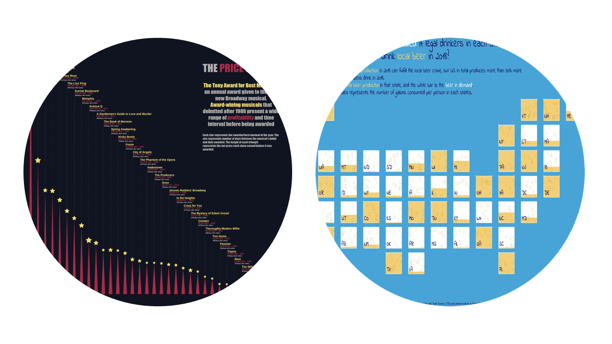

<h1 style="font-weight:normal" align="center">
  &nbsp;Hi, I'm Gordon Tu! :wave:&nbsp;
</h1>

**I am a chemistry student who choose to follow his passion to be a data visualization designer. I am developing storyteling skills, designing mind and data science techniques.**

To visualize data I mainly utilize the package [`{ggplot2}`](https://ggplot2.tidyverse.org/) from the [`{tidyverse}` package collection](https://www.tidyverse.org/) including many more that I use on a daily basis for all kinds of data preparation and analysis.

 

### :sparkles: Data Visualization

My passion for data, design and stores is a perfect combination to humanize data through visualization. By contributing to challenges such as [TidyTuesday](https://github.com/Z3tt/TidyTuesday), #100daysProject. I am constantly strengthening my skills in design and reproducible data visualization with `{ggplot2}`, `{d3.js}` and `{Tableau}`. 

&nbsp;&nbsp;&nbsp;&rarr; <i>Have a look at my [dataviz portfolio](tuyukun.com)</i>

My portfolio is growing in both Chinese and English. It will include my learning journey and my data vis design.

My personal website, built using the R package [`blogdown`](https://bookdown.org/yihui/blogdown/), the [Hugo Academic](https://themes.gohugo.io/academic/) theme, and [Netlify](https://www.netlify.com/).

Web elements are largely inspired by [Connor Rothschild](https://www.connorrothschild.com/) and [Isabella Benabaye](https://isabella-b.com/)
.
