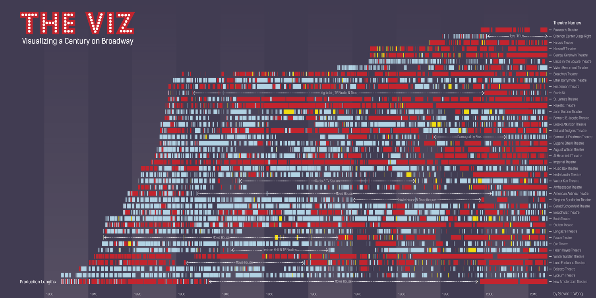
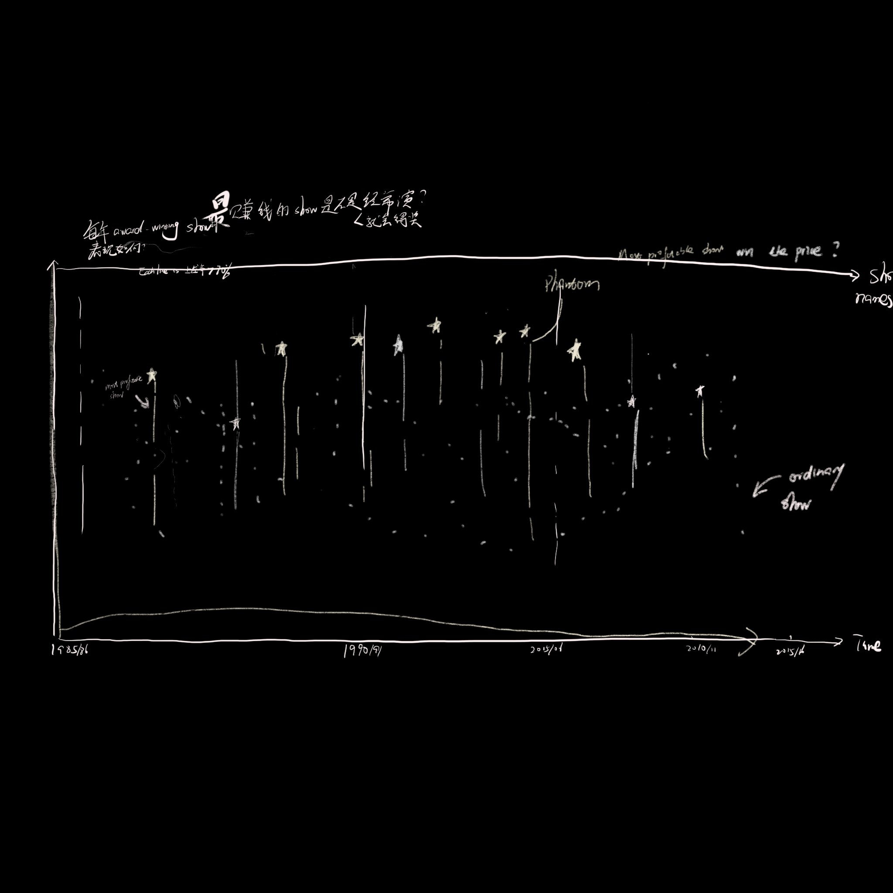
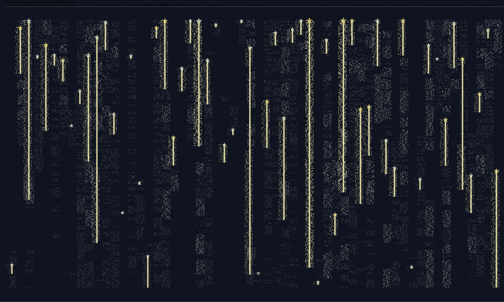
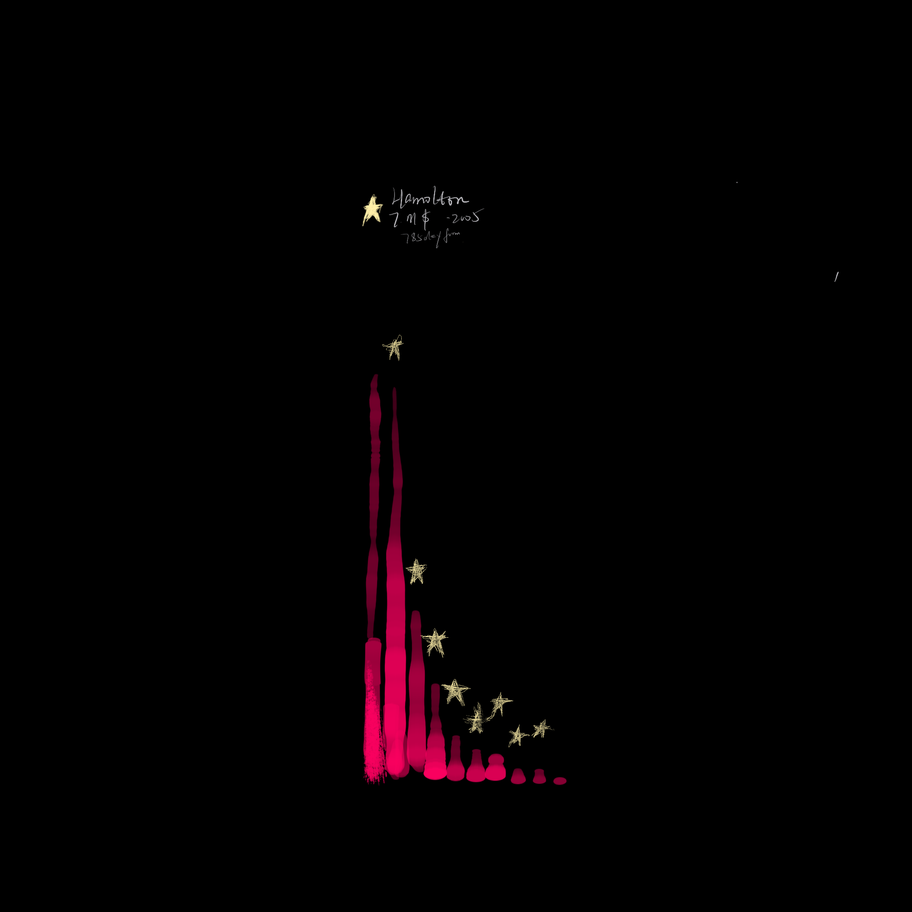
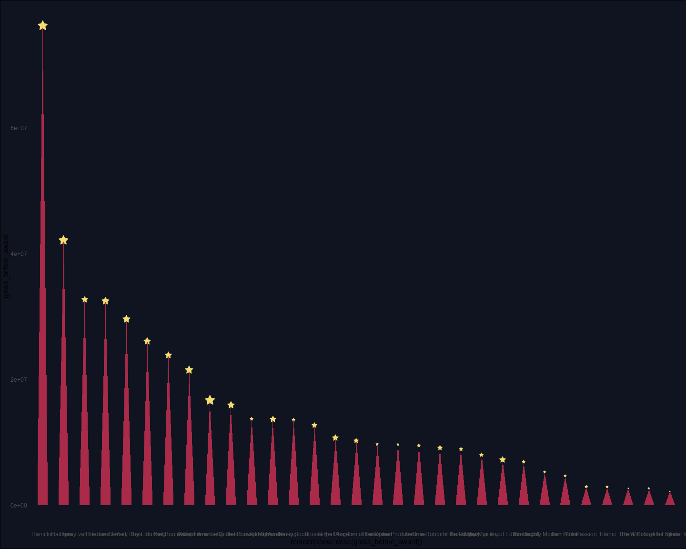

# Define Goals
When I saw going through TidyTuesday's repo, Broadway Musical data totally drew my attention. I think I can learn some interesting things from creating a data visualizaiton about musicals. 

I briefly glimpsed at the data, and it basically covers the sales of all Broadway shows from 1980s. Then I think:"wow,it would be so cool if I can show all the shows in one graph!"

Here we go: an explorative data vis with headline--"A 40-year recap of Braodway Musicals"

# Prepare 
Data visualization is becoming a very populous field. I would never doubt that someone came up with the same idea as I do and succesfully delivered it.

I went online and searched Broadway visualization. Unsurprisingly, this Steven Wong did what I thought, but covered a whole century!

Figure 1. Steven Wong's [The Viz: Visualizing a Century on Broadway](http://www.oksteven.com/work#/the-viz/)

I was so happy to see such a great and aesthetic visualization. Then I thought: I wish I could do the same thing!(or something different!)

# Explore & Discover
I basically EDA the whole dataset for hours, and it turned out that this dataset is not for that kind of visualization. Moreover, I had no idea to recreate Wong's work.

Untill......

In a short [Twitter interaction](https://twitter.com/CedScherer/status/1288181995714093057) with Cédric Scherer, he taught me THREE ways to do so in R: geom_segment(), geom_linerange(), geom_point(shape = "|").

## Steer away
Since this dataset can't really fulfill my point, I looked up online and download another Tony Award dataset from Wikipedia.

New idea: How are award-winning muscials doing throughout the years in different theatres?

# Sketch
I played a little bit with those functions, then decide on scatter plot as the backbone.

Then I quickly prototyped my vis

<!--  -->

I thought it would be so artistic to have awarded show represented by stars, but...

# Design

It looks not right. Then I interviewed my friends in the data science field as well as my family members. They agreed on one thing: the first sight reminded them nothing about stars but more hacking code scenes in movies.

Audiences' review are very important. 

The visual metaphor of this plot is reminding people something instead of stars, and the information is overwhelming.

I rethought my design and the headline of my graph again?

# Re-design & Re-headline
How about just showing the award-winning shows?

What is interesting about award-winning shows?

**Answer: they won awards.**

I quickly got intrigued by the idea that how much money each award-winning muscial earned and how long it took before the award.

Another ggplot2 master's work inspired me. Georgios Karamanis made plot by placing triangular bars on top of each European country on a map.

Triangular "bar" charts plus stars on the tips to highlight the stars. Red and glowing yellow represents stage curtain and trophy, and annotations on the top of every star showing.

I showed the same people. They were kinda amazed by my color choice. 
It took me less than one hour to plot the draft below

Then another forty minutes to annotate the graph in R. 40 more minutes to finalize the title in Adobe Illustrator.

